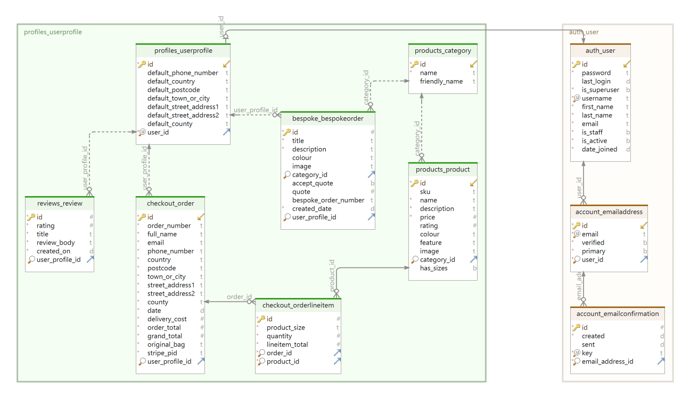
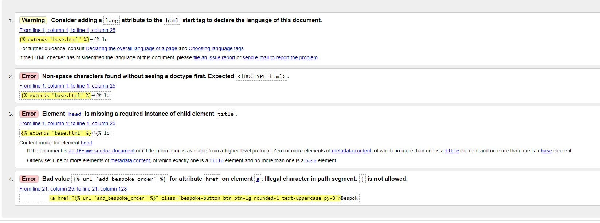
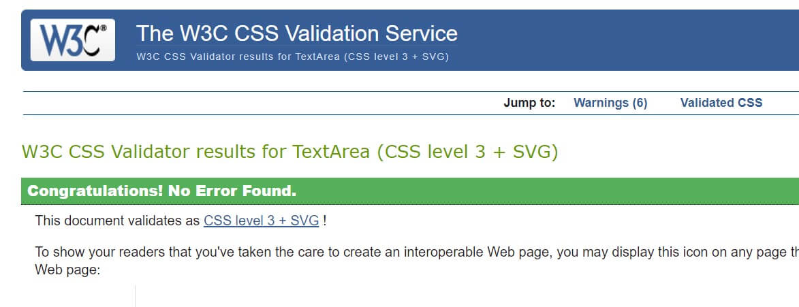
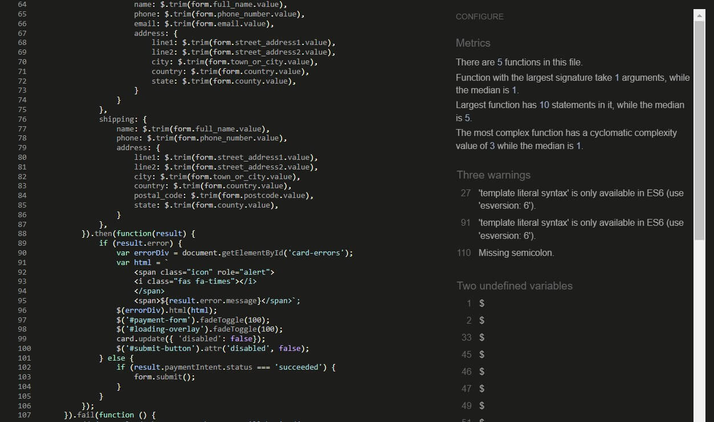
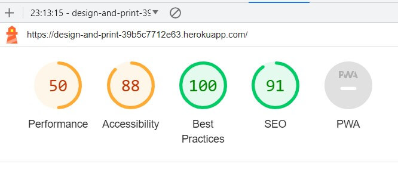
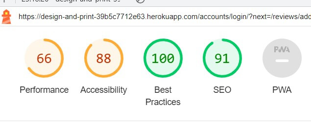
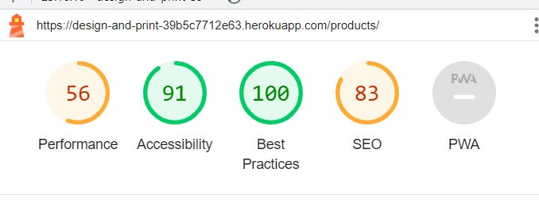
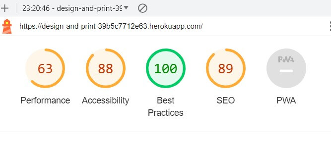
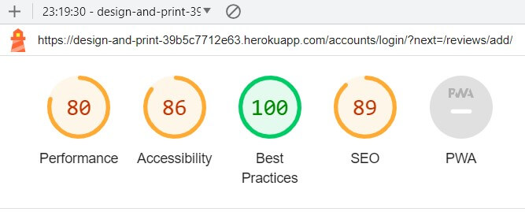
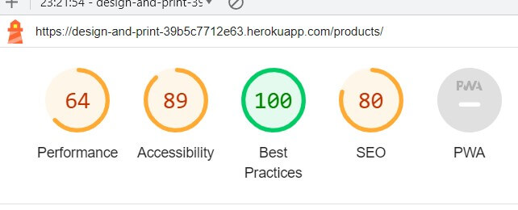

# Design and Print Website - Emma Scott
## Milestone Project 4 - Full Stack Development

## Introduction
Design and Print is a full stack e-commerce website built using Django, Python, HTML, CSS and JavaScript. The website utilises Stripe to process payments.
This project was created as my fourth milestone project for my Level 5 Diploma in Web Application Development with Code Institute.

[Visit Design and Print here.](https://design-and-print-39b5c7712e63.herokuapp.com/)

___

## Table of Contents

* [User Experience (UX)](#user-experience)
  * [Strategy Plane](#strategy-plane)
    * [Project Goals](#project-goals)
  * [Scope Plane](#scope-plane)
    * [Feature Planning](#feature-planning)
  * [Structure Plane](#structure-plane)
    * [User Stories](#user-stories)
    * [Database](#database)
  * [Skeleton Plane](#skeleton-plane)
    * [Wireframes](#wireframes)
  * [Surface Plane](#surface-plane)
    * [Colour Scheme](#colour-scheme)
    * [Typography](#typography)
    * [Imagery](#imagery)
* [Features](#features)
    * [Features](#features)
    * [Future Features](#future-features)
* [Technologies Used](#technologies-used)   
* [Testing](#testing)
  * [Manual Testing](#manual-testing)
  * [Validator Testing](#validator-testing)
  * [Bugs](#bugs)
* [Deployment](#deployment)
  * [Cloning](#cloning)
  * [Django](#Django)
  * [ElephantSQL](#elephantsql)
  * [Deployment to Heroku](#deployment-to-heroku)
  * [Stripe](#stripe)
  * [AWS](#aws)
* [Credits](#credits)
  * [Code Used](#code-used)
  * [Media](#media)
  * [Acknowledgments](#acknowledgments)

___

## User Experience

### Strategy Plane

#### **Project Goals**

Design and Print is an e-commerce site (for educational purposes only) that allows customers to order products to be printed, place bespoke orders for printing and for the site owners to run a print business. The timing of this project fortunately occured at the same time that I had a to prepare a presentation for a job interview where, by a happy co-incidence, I was required to provide a business solution for a print service! Hence, Design and Print was born! 

### Scope Plane

#### **Feature Planning**

The main features for production are:
* Home Page
* Product page
* Product search
* Bag/Basket page
* Checkout system
* Payment system via Stripe
* Sign In page
* Sign Out page
* Register page
* Profile page
* Product Management - Admin only
* Bespoke Order page
* Bespoke Quote page - Admin Only
* Bespoke acceptance page
* Submit Review page
* View Reviews page
* Review management - Admin Only

### Structure Plane

#### **User Stories**

| User Story | As a | I want to be able to ... | so that I can... |
| :--- | :--- | :--- | :---|
| 1 | Customer | easily navigate the site | find products easily and find the page that I want quickly. |
| 2 | Customer | register for an account | have a personal account and view my profile. |
| 3 | Customer | receive an email after registration | know my registration was successful.  |
| 4 | Customer | login and logout of my account | access my personal information everytime I visit the site. |
| 5 | Customer | view my profile page  | see my order history and edit my delivery information.  |
| 6 | Customer | view all products on the site  | find the product I am interested in ordering and compare products. |
| 7 | Customer | filter products by categories  | find the specific products I am interested in and compare products in order.  |
| 8 | Customer | view detailed information about a product  | see the specific details of price, size, description and image.  |
| 9 | Customer | view items in my basket  | see the items I want to purchase and the cost.  |
| 10 | Customer | edit the quantity of items in my basket  | increase or decrease quantities.  |
| 11 | Customer | enter my payment details easily  | purchase products with minimal fuss.  |
| 12 | Customer | receive confirmation of my purchases  | track my orders and be assured the order has been processed.  |
| 13 | Customer | place a unique, bespoke order  | purchase a product unique to me.  |
| 14 | Customer | receive a quoted price for my bespoke order  | accept or decline the price before being commmited to purchasing it.  |
| 15 | Customer | leave a review of the service  | provide feedback for the business.  |
| 16 | Customer | read other customer's reviews  | in order to decide if I want to use the service.  |
| 17 | Customer | view a 404 page if the path can't be found  | to allow me to go back to the site.  |

| User Story | As a | I want to be able to ... | so that I can... |
| :--- | :--- | :--- | :---|
| 18 | Site Admin | easily add products to the site | advertise my products quickly and easily. |
| 19 | Site Admin | easily edit products | update my products quickly and easily. |
| 20 | Site Admin | easily delete products | remove unwanted products quickly and easily. |
| 21 | Site Admin | view the orders being made | assess the work that needs completing. |
| 22 | Site Admin | manage bespoke requests | provide a custom service. |
| 23 | Site Admin | manage customer reviews | remove inappropriate reviews. |

#### Database

The relational database ElephantSQL was used for this project. The following data models were used:
* Category - stores information about the product categories.
* Products - stores information about the products.
* Order - stores order infomation.
* User Profile - stores user information.
* Review - stores customer reviews.
* Bespoke orders - stores unique custom orders.

The following schema was created with DbSchema: Database Diagram Designer & Management Tool.

[Back to top](#table-of-contents)
___

### Skeleton Plane

#### **Wireframes**

The wireframes for the project were created using Balsamiq.

* Base Template - this contains a header and a footer which are displayed throughout the site.

* Home Page - The home page features an eye-catching image and a link to go directly to the bespoke order page. The nav bars are responsive on different size devices. The search feature searches through the title and the description of the products in the database and returns any products that match. There is a top nav bar that features drop-down menus to enable the user to navigate the different pages of the site, and to display only certain categories of product from the database. The site title enables the user to redirect to the Home page so they never have to use the browser's back button to navigate. 

* Register Page - This enables users to sign up for an account using their email address. Once they have complete this, a confirmation email is sent to their registration email address which they need to click on to complete registration.

* Login Page - The login page enables users to sign into their account with their username and password. A toast message displays that the action was successful.

* Logout Page - The logout page enables the user to logout. When the user clicks the logout button, they will be directed to a confirmation page and then logged out of their account and redirected to the home page. A toast message displays that the action was successful.

* Profile Page - The profile page enables a user to view their default delivery information. It also displays their order history. The user can click on the order for a detailed view of the order. 

* Products - The products page shows all images in the category. It includes an item image and the product details: title, price, category and rating. The page is responsive on different device sizes.

* Product Information - This takes the user to a detailed view of a product. The page includes an image of the product and the product details: title, price, category, and rating. It also includes a quantity selector for the user to choose how many of the product they would like to purchase, and 'Add to bag' button and 'back' to products buttons. This ensures that the user does not need to use the browser ‘back’ button.

* Product Detail (Admin View) - This page is the same as the product detail page, but is only displayed to logged in Admin users. It features edit and delete buttons to allow the admin to edit and delete a product from the database.

* Bag Page – This page displays an image of the item, and the product details. The user is then able to select the ‘checkout’ button to complete their purchase or to ‘keeping shopping’ if they would prefer to make further additions. This ensures they do not need to use the browser’s back button to navigate the site. 

* Checkout Page – This displays the items the user has added to their bag. When the user clicks on the checkout button, they are presented with a form to fill in their details, along with their delivery address. They are given the option to save the information they enter to their profile via a checkbox. The form is pre-populated with this information if they are signed in.
Below this is the payment input section. The user will be required to enter their card information. If there are errors with the information they enter, an error message will be displayed under the input. Once the user clicks on the 'complete order' button, an overlay showing the purchase is in progress is displayed, then a small toast message confirms the purchase has been successful. The user is also redirected to a page that confirms their order number.

* Bespoke Orders Page – This enables users to request a custom order. The form enables them to select a product category, enter a title, description and colour. They are also able to upload an image to be included on the custom order. Once they have submitted this, the admin is able to provide a quoted price for the order.

* Bespoke Orders Admin Page – Due to the nature of a custom order being unique, the Admin user is able to provide a quote for the price of the purchase.

* All Bespoke Orders Admin Page – The Admin user is able to view all requests for Bespoke orders.

* Bespoke Orders Accept Page – Once the Admin user has provided a quote, the user can accept or decline the quote before the order is processed. 

* Reviews Page – Users can post a review of the service they have received. This page displays all customer reviews. 

* Reviews Page (Admin View) – Admin users can delete a review if they feel it is inappropriate, duplicated, offensive, etc.  

* Add a Review Page – Users can post a review of the service they have received using the form on this page. This form features a title input, a description text area and a rating which is set to a maximum of 5 and a minimum of 1.  

[Back to top](#table-of-contents)

### Surface Plane

#### **Colour Scheme**

The colour scheme for the site is very neutral, in order to not distract from the products and page content. A dark blue is used on a white background for good contrast and accessibility. The blue background and bright image on the home page are intended to convey the clarity and quality of the business' products. White text is used on this page for high contrast to provide good accessibility. 

#### **Typography**
All fonts are from Google Fonts. I chose 'Righteous' for the logo font and headings as it is crispy and clear and has a profesional look. This has a fall-back font of cursive.
All other text on the site uses 'Raleway' with sans-serif as a fall-back, for accessibility purposes as it is easy to read.

#### **Imagery**
The hero image on the site was chosen to convey a professional, high-quality impression due to it's vivid colours.

[Back to top](#table-of-contents)
___

## Features

### General Features

* Nav Bar - The mav bar consists of two parts: the top header which contains the account icon, the basket icon, the search bar and the site name and the main nav which inclues links to the product categories, reviews and bespoke orders. The nav bar is fully responsive on all screen sizes. On mobile view, a hamburger menu provides ease of access to the nav bar links.

* Footer - The footer contains social media links and contact information, such as phone number, address and email address for ease of access. The footer is responsive on all screen sizes, with the footer headings being hidden on small devices.

* Toasts - These are used to provide feedback to the user, telling them if their action has been successful or if an error has occured. This is conveyed to the user via text and colour. Toasts have a small cross for the user to dismiss them. I deliberately chose not to have them automatically dismiss so a user does not miss the message. 

### Future Features

Ideas for future implementation include:
* Defensive programming -  I had hoped to have time to implement defensive programming to prevent a user accidentally deleting an order.

* Admin approval of reviews - at present customers can post a review without an admin user being able to validate it. This could lead to offensive reviews, which can be removed by admin but would be beneficial to be able to prevent them being displayed at all.  

* Order views on mobile devices - at present, due to time constraints the order summary involves the user needing to do a lot of scrolling to view it. In future I would change this to be more responsive.

* Social Media Logins - The ability for users to log in using a social media account.

[Back to top](#table-of-contents)
___

## Technologies Used

* HTML5 - to create the structure of the website.
* CSS3 - to style the website.
* Bootstrap - to style the website content.
* JavaScript - to add interactivity to the website.
* Python - to build the backend of the website.
* Django - to build the website.
* Django Allauth - account management.
* Git and GitHub - version control to commit and push to GitHub.
* GitPod - development environment.
* Chrome DevTools - to test responsiveness and fix bugs.
* Heroku - to deploy the website.
* Elephant SQL - the database.
* Stripe - to process the card payment functionality.
* Amazon AWS - to store the static and media files.
* Google Mail - to generate emails.
* Font Awesome - website icons.
* Google Fonts - website fonts.
* Balsamiq - for designing the wireframes.

[Back to top](#table-of-contents)
___

## Testing
### Manual Testing
The following testing was carried out:

* Customer Stories:

| User Story | As a | I want to be able to ... |  Test carried out | Test Passed? |
| :--- | :--- | :--- | :---| :---|
| 1 | Customer | easily navigate the site | all links and buttons working | Yes |
| 2 | Customer | register for an account | Multiple user accounts created. |  Yes |
| 3 | Customer | receive an email after registration | Emsil received  |  Yes |
| 4 | Customer | login and logout of my account | Logged in and out of multiple accounts |  Yes |
| 5 | Customer | view my profile page  | Navigated to profile page  |  Yes |
| 6 | Customer | view all products on the site  | Checked database that all products are displaying. |  Yes |
| 7 | Customer | filter products by categories  | All filters tested. | Yes |
| 8 | Customer | view detailed information about a product  | Product details displaying for each product.  |  Yes |
| 9 | Customer | view items in my basket  | Tested on multiple accounts and various products |  Yes |
| 10 | Customer | edit the quantity of items in my basket  | increased and decreased quanities as expected  | Yes |
| 11 | Customer | enter my payment details easily  | Payment tested using Stripe test number  |  Yes |
| 12 | Customer | receive confirmation of my purchases  | Payment made - toasts displaying and returning to confirmation page |  Yes |
| 13 | Customer | place a unique, bespoke order  | Input details into order form on bespoke page  |  Yes |
| 14 | Customer | receive a quoted price for my bespoke order  | Accept or decline the price before being commmited to purchasing it.  | Yes |
| 15 | Customer | leave a review of the service  | Write a review  |  Yes |
| 16 | Customer | read other customer's reviews  | Select all reviews page and have all reviews display.  | Yes |
| 17 | Customer | view a 404 page if the path can't be found  | changed the url path to see if a 404 page displays  | Yes |

* Admin Stories:

| User Story | As a | I want to be able to ... | Test carried out | Test Passed? |  
| :--- | :--- | :--- | :---| :---|
| 18 | Site Admin | easily add products to the site | Add an additional product to the site |  Yes |
| 19 | Site Admin | easily edit products | Edit the details in each input. |  Yes |
| 20 | Site Admin | easily delete products | Delete several products |  Yes |
| 21 | Site Admin | view the orders being made | View all orders on one page. Click on each one for full details. |  Yes |
| 22 | Site Admin | manage bespoke requests | View custom orders to provide a quoted price |  Yes |
| 23 | Site Admin | manage customer reviews | Remove reviews by clicking on delete. |  Yes |

#### Stripe
The following test card details were used for testing Stripe:
* Card Number: 4242 4242 4242 4242
* Date: 0424
* CVC: 242
* Postcode: 42424

### Validator Testing

#### HTML
W3C was used to validate the HTML on all pages of the site. 

#### CSS

The W3C CSS Validator wasused for the CSS. No issues were identified.

#### Flake8

Flake8 was used to validate the Python code. This showed several over/under indentations, some trailing whitespace, some missing empty lines and several lines that are too long. These issues were all adressed apart from the lines that are too long from migrations, and some of the other lines that are too long, which would need to be addressed in future.

#### JSHint
The javascript code was validated using JSHint.
The stripe_elent.js only had three advisory warnings.

#### Lighthouse Testing

I used Lighthouse in Chrome Dev Tools to run three typical reports on the website:

* Mobile View

Mobile Home page

Mobile Sign In page

Mobile Products page

* Desktop View

Desktop Home page

Desktop Sign In page

Desktop Products page

There are a few improvments to be made on the performance on mobile and desktop views which would need to be addressed at a later date.

### Bugs
* The Secret Key was accidentally exposed during a commit. This was recitified by generating a new Secret Key.

* When trying to connect to AWS, the connection was failing when trying to collect the static files and upload them into AWS. Eventually I discovered two typos in custom_storage.py. 

* The footer was not displaying at the bottom of the page when there was no body content. Making the body content 100% resolved this.

* The nav bar wouldn't display towards the beginning of the project. I discovered a typo in the word class. 

#### Unresolved Bugs
* The star rating is set to a maximum value of 5 and a minimum of 1 however the rating incrementor can go beyond 5 and below 0.

[Back to top](#table-of-contents)
___

## Deployment

### Cloning
To clone the repository:

1. Navigate to the main repository page in GitHub.

2. Click the Code button, select clone with HTTPS, SSH or the GitHub CLI and copy the link.

3. Open the terminal in your preferred IDE. Change the working directory to the target location for the cloned repository.

4. In the terminal, type 'git clone' followed by the copied URL. 

5. Install the packages from the requirements.txt file by running pip3 install -r requirements.txt in the terminal.

### Django

1. In the terminal enter, pip3 install 'django<4'.
2. Then enter, django-admin startproject your project name
3. You will see the django project folder, including settings.py and urls.py.
4. Back to the terminal, enter touch .gitignore.
5. In the .gitignore file enter, *.sqlite3 and *.pyc and pycache
6. Run the project by entering python3 manage.py runserver to check it is running well. Your page should show a rocket with 'The install worked successfully! Congratulations!' below it.
7. Back in the terminal CTRL + C to quit the server.
8. Migrate: enter, python3 manage.py migrate.
9. Create a superuser: enter, python3 manage.py createsuperuser. Provide username, email (or skip this by hitting enter) and password.
10. Enter: git add . in the terminal
11. Then: git commit -m "your commit message"
12. Enter: git push to push the changes.

### ElephantSQL

To create a database:

1. Go to ElephantSQL.com and select create a new instance.
2. Select the free database plan.
3. Set up your plan. Give it the same name as your project.
4. Select the region closest to you.
5. Select review and then Create instance.
6. Return to the ElephantSQL dashboard and click on the database instance name for this project
7. In the URL section, copy the database URL to your clipboard

### Deployment to Heroku

You must have Git and the Heroku CLI installed to deploy with Git.

1. Go to Heroku and sign up if you don’t already have an account.
2. On the dashboard view, click the New button and select Create new app.
3. Enter your app name and select your region. 
4. Click Create app button.
5. Click on the deploy tab. Select the GitHub logo.
6. You will be prompted to find your GitHub repository to connect to. Enter your repository name for your GitHub project and click on the search button.
7. Once your GitHub repository has been found click the connect button.
8. Before enabling the automatic deploy you will need to go to Settings then the Config Vars section.
9. In the Config Vars section select Reveal Config Vars. Add the following values:
* AWS_ACCESS_KEY_ID enter YOUR_AWS_ACCESS_KEY_ID
* AWS_SECRET_ACCESS_KEY enter YOUR_AWS_SECRET_ACCESS_KEY
* DATABASE_URL enter YOUR_POSTGRES_URL
* EMAIL_HOST_PASS enter YOUR_EMAIL_HOST_PASS
* EMAIL_HOST_USER enter YOUR_EMAIL_HOST_USER
* SECRET_KEY enter YOUR_SECRET_KEY
* STRIPE_PUBLIC_KEY enter YOUR_STRIPE_PUBLIC_KEY
* STRIPE_SECRET_KEY enter YOUR_STRIPE_SECRET_KEY
* STRIPE_WH_SECRET enter YOUR_STRIPE_WH_SECRET
* USE_AWS enter TRUE
10. Go back to the Deployment section and scroll down to the Automatic Deploy section. Select the Automatic Deploy button.
11. Click on the Deploy Branch button and your app will be deployed.

### Stripe
1. Register for a Stripe account.
2. Go to 'Developers' on 'Dashboard'.
3. Go to 'API Keys' to view public and secret key.
4. In .env file add STRIPE_PUCLIC_KEY AND STRIPE_SECERET_KEY.
5. Copy in public and secret keys from Stripe.
6. Head to Heroku and open the app.
7. Click on 'settings' and 'Reveal Config Vars'
8. Add the STRIPE_PUCLIC_KEY AND STRIPE_SECERET_KEY with their keys from Stripe.

### AWS
1. Create a Amazon AWS account.
2. Open S3 application and create a bucket.
3. Select an AWS Region.
4. Uncheck the 'Block All Public Access' setting. Click on accept that the bucket will be public.
5. In 'Properties', go to the 'Static Website Hosting' and click 'Edit'.
6. Turn on 'Static Website Hosting' and set index.html and errors.html values.
7. In 'Permissions', click 'Edit' on the CORS configuration.
8. Edit 'Bucket Policy' and generate and set configuration 'Bucket Policy'.
9. Go to 'Access Control List' and set list object permission for everyone.
10. Open IAM application and set up a user group.
11. Click on 'Policies' and 'Create Policy'.
12. Click on the JSON tab and import a pre-built Amazon policy called AmazonS3FullAccess.
13. Click 'Review Policy', and provide name and description then 'Create Policy'.
14. Navigate to 'Groups' then 'Permissions' and 'Add Permission' then 'Attach Policy'. Click 'Add User' and create one.
15. Add the user to the group and download the CSV with the user's access credentials.
16. Add the AWS code in settings.py with an environment variable called USE_AWS.

[Back to top](#table-of-contents)
___

## Credits

### Code Used

* A lot of the code was taken from the Boutique Ado walkthrough project on Code Institute.
* The code for the gradient 'Bespoke' button on the Home page came from https://gradientbuttons.colorion.co/?utm_content=cmp-true
* The code for fixing the footer bug was adapted from https://dev.to/nehalahmadkhan how-to-make-footer-stick-to-bottom-of-web-page-3i14

### Tools

* Database schema created with DbSchema: Database Diagram Designer & Management Tool.
* Tiny PNG was used to compress images. https://tinypng.com/
* Website Mockup Generator: https://websitemockupgenerator.com/

### Media

* Images are all royalty free and taken from:

https://www.vecteezy.com/vector-art/1950048-realistic-yellow-notebook-with-a4-paper-set notepad
Business card https://www.vecteezy.com/vector-art/8254460-business-card-design-template
https://www.vecteezy.com/vector-art/692110-circle-cutout-blue-business-card-template business card
https://www.vecteezy.com/vector-art/1893372-vector-modern-creative-and-clean-business-card-template
https://www.vecteezy.com/vector-art/250628-abstract-stylish-wave-business-card-template-design

https://www.canva.com/templates/EAFLhgVjZDo-black-white-simple-real-estate-listing-business-card/
https://www.canva.com/templates/EAFgbWSHdks-red-black-dynamic-gym-trainer-business-card/
https://www.canva.com/templates/EAFQHkE0bec-red-black-creative-modern-business-card/
https://www.canva.com/templates/EAFGMTVbLYU-professional-business-card/

Notepads: 
https://www.vecteezy.com/vector-art/23165690-spiral-binder-notebook-vector-mockup-template
https://www.vecteezy.com/vector-art/1977680-set-of-realistic-notebooks-and-pencil-vector-illustration
https://www.vecteezy.com/vector-art/3231641-notepads-with-empty-lined-and-checkered-paper

Calendars
https://www.vecteezy.com/vector-art/4609884-one-page-2022-calendar-design-template-editable-file
https://www.vecteezy.com/vector-art/3044536-set-desk-calendar-2022-template-design-set-of-12-months
https://www.vecteezy.com/vector-art/94968-2016-calendar
https://www.vecteezy.com/vector-art/16363072-2023-calendar-design-with-holiday-2023-calendar-design-template-calendar-2023-calendar-design

https://www.canva.com/templates/EADahxMOCWc-colorful-illustrated-weekly-calendar/
https://www.canva.com/templates/EAFLbdj0EXc-pink-simple-customizable-october-2022-calendar/
https://www.canva.com/templates/EAFRhP7wQQw-green-creative-weekly-calendar/

Stickers
https://www.canva.com/templates/EAFcYwotyqU-black-and-white-neutral-hand-made-circle-sticker/
https://www.canva.com/templates/EAFVbMJdIso-white-minimalist-aesthetic-thank-you-circle-sticker/
https://www.canva.com/templates/EAFXOUNUcPA-teal-and-white-simple-cupcake-business-circle-sticker-label/
https://www.canva.com/templates/EAFYHoaxixU-pink-simple-product-label-rectangle-sticker/
https://www.canva.com/templates/EAFcfLMbwBM-pink-playful-illustration-shampoo-label/

Flyers
https://www.canva.com/templates/EAFbRy3hG0Y-project-status-report-professional-doc-in-dark-blue-light-blue-playful-abstract-style/
https://www.canva.com/templates/EAFTecJCu-E-project-overview-doc-in-light-green-blue-vibrant-professional-style/
https://www.canva.com/templates/EAFW3qlv8qo-press-release-doc-in-blue-pink-bold-style/

Posters
https://www.canva.com/templates/EAFGG0-jWsc-blue-futuristic-technology-poster/
https://www.canva.com/templates/EAFMo02Phxk-blue-gradient-technology-poster/
https://www.canva.com/templates/EAFH2p69h4g-purple-modern-future-destiny-movie-poster/
https://www.canva.com/templates/EAFNA4Z8qps-red-beige-modern-illustration-blood-donation-poster/
https://www.canva.com/templates/EAFb80T7RhM-grey-black-and-yellow-modern-professional-business-conference-poster/

Brochures
https://www.canva.com/templates/EAFDLsUlh6Q-yellow-modern-geometric-trifold-brochure/
https://www.canva.com/templates/EAFa6775kjs-blue-orange-minimalist-abstract-corporate-business-trifold-brochure/
https://www.canva.com/templates/EADajBG9Ybc-green-and-blue-banking-corporate-trifold-brochure/

### Acknowledgments
* I would like to thank my new mentor Derek Macauley, for taking me on at the last minute and for his advice and guidance throughout the project.
* I would also like to thank my friends and family for helping me test the site.

[Back to top](#table-of-contents)
___