# Design and Print Website - Emma Scott
## Milestone Project 4 - Full Stack Development

## Introduction
Design and Print is a full stack e-commerce website built using Django, Python, HTML, CSS and JavaScript. The website utilises Stripe to process payments.
This project was created as my fourth milestone project for my Level 5 Diploma in Web Application Development with Code Institute.

[Visit Design and Print here.](https://design-and-print-39b5c7712e63.herokuapp.com/)

___

## Table of Contents

* [User Experience (UX)](#user-experience)
    * [Strategy Plane](#strategy-plane)
    * [Project Goals](#project-goals)
  * [Scope Plane](#scope-plane)
    * [Feature Planning](#feature-planning)
  * [Structure Plane](#structure-plane)
    * [User Stories](#user-stories)
    * [Database](#database)
  * [Skeleton Plane](#skeleton-plane)
    * [Wireframes](#wireframes)
  * [Surface Plane](#surface-plane)
    * [Colour Scheme](#colour-scheme)
    * [Typography](#typography)
    * [Imagery](#imagery)
    * [Base Mockup](#base-mockup)
2. [Features](#features)
    - [Features](#features)
    - [Future Features](#future-features)
3. [Technologies](#technologies)
    - [Languages](#languages)
    - [Frameworks & Libraries](#frameworks-and-libraries)
    - [Storage & Hosting](#storage-and-hosting)
4. [Testing](#testing)
5. [Deployment](#deployment)
    - [Heroku](#heroku)
6. [Credits](#credits)
    - [Content](#content)
    - [Media](#media)
    - [Acknowledgements](#acknowledgements)

___

## User Experience

### Strategy Plane

#### **Project Goals**

Design and Print is an e-commerce site (for educational purposes only) that allows customers to order products to be printed, place bespoke orders for printing and for the site owners to run a print business. The timing of this project fortunately occured at the same time that I had a to prepare a presentation for a job interview where, by a happy co-incidence, I was required to provide a business solution for a print service! Hence, Design and Print was born! 

### Scope Plane

#### **Feature Planning**

The main features for production are:
* Home Page
* Product page
* Product search
* Bag/Basket page
* Checkout system
* Payment system via Stripe
* Sign In page
* Sign Out page
* Register page
* Profile page
* Product Management - Admin only
* Bespoke Order page
* Bespoke Quote page - Admin Only
* Bespoke acceptance page
* Submit Review page
* View Reviews page
* Review management - Admin Only

### Structure Plane

#### **User Stories**

| User Story | As a | I want to be able to ... | so that I can... |
| :--- | :--- | :--- | :---|
| 1 | Customer | easily navigate the site | find products easily and find the page that I want quickly. |
| 2 | Customer | register for an account | have a personal account and view my profile. |
| 3 | Customer | receive an email after registration | know my registration was successful.  |
| 4 | Customer | login and logout of my account | access my personal information everytime I visit the site. |
| 5 | Customer | view my profile page  | see my order history and edit my delivery information.  |
| 6 | Customer | view all products on the site  | find the product I am interested in ordering and compare products. |
| 7 | Customer | filter products by categories  | find the specific products I am interested in and compare products in order.  |
| 8 | Customer | view detailed information about a product  | see the specific details of price, size, description and image.  |
| 9 | Customer | view items in my basket  | see the items I want to purchase and the cost.  |
| 10 | Customer | edit the quantity of items in my basket  | increase or decrease quantities.  |
| 11 | Customer | enter my payment details easily  | purchase products with minimal fuss.  |
| 12 | Customer | receive confirmation of my purchases  | track my orders and be assured the order has been processed.  |
| 13 | Customer | place a unique, bespoke order  | purchase a product unique to me.  |
| 14 | Customer | receive a quoted price for my bespoke order  | accept or decline the price before being commmited to purchasing it.  |
| 15 | Customer | leave a review of the service  | provide feedback for the business.  |
| 16 | Customer | read other customer's reviews  | in order to decide if I want to use the service.  |

| User Story | As a | I want to be able to ... | so that I can... |
| :--- | :--- | :--- | :---|
| 1 | Site Admin | easily add products to the site | advertise my products quickly and easily. |
| 2 | Site Admin | easily edit products | update my products quickly and easily. |
| 3 | Site Admin | easily delete products | remove unwanted products quickly and easily. |
| 4 | Site Admin | view the orders being made | assess the work that needs completing. |
| 5 | Site Admin | manage bespoke requests | provide a custom service. |
| 6 | Site Admin | manage customer reviews | remove inappropriate reviews. |

#### **Database **

The relational database ElephantSQL was used for this project. The following data models were used:
* Category - stores information about the product categories.
* Products - stores information about the products.
* Order - stores order infomation.
* User Profile - stores user information.
* Review - stores customer reviews.
* Bespoke orders - stores unique custom orders.

[Back to top](#table-of-contents)
___

### Skeleton Plane

#### **Wireframes**

The wireframes for the project were created using Balsamiq.

* Base Template - this contains a header and a footer which are displayed throughout the site.
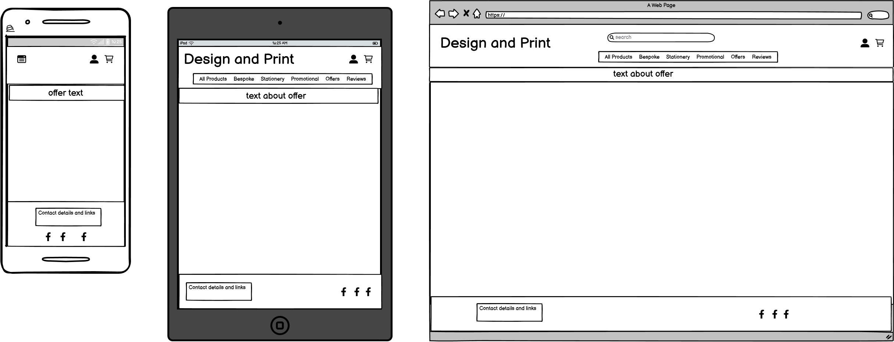

* Home Page - The home page features an eye-catching image and a link to go directly to the bespoke order page. The nav bars are responsive on different size devices. The search feature searches through the title and the description of the products in the database and returns any products that match. There is a top nav bar that features drop-down menus to enable the user to navigate the different pages of the site, and to display only certain categories of product from the database. The site title enables the user to redirect to the Home page so they never have to use the browser's back button to navigate. 

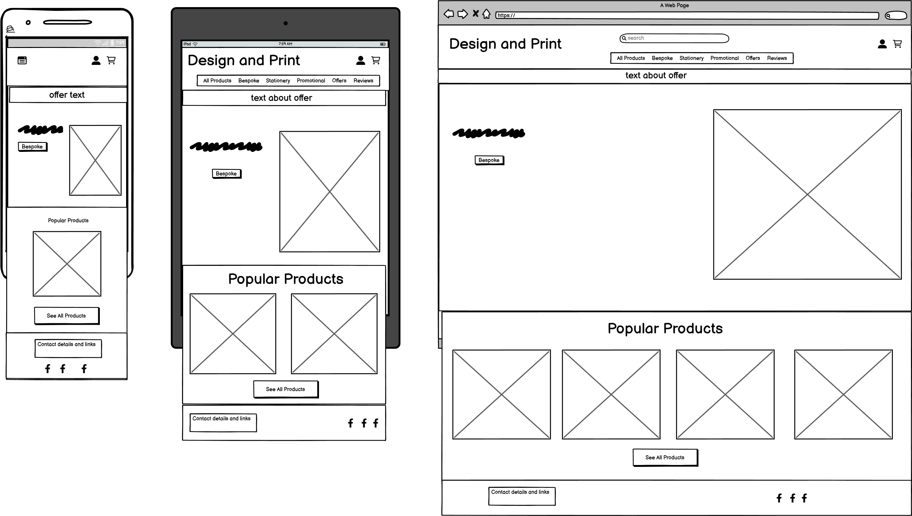

* Register Page - This enables users to sign up for an account using their email address. Once they have complete this, a confirmation email is sent to their registration email address which they need to click on to complete registration.

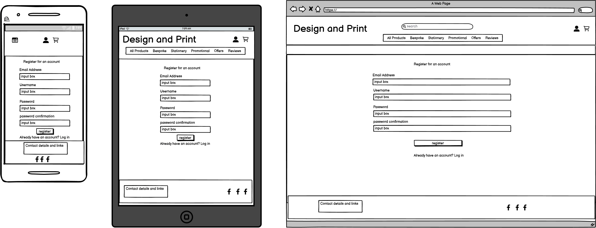

* Login Page - The login page enables users to sign into their account with their username and password. A toast message displays that the action was successful.

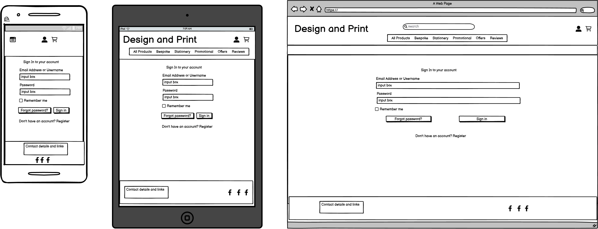

* Logout Page - The logout page enables the user to logout. When the user clicks the logout button, they will be directed to a confirmation page and then logged out of their account and redirected to the home page. A toast message displays that the action was successful.

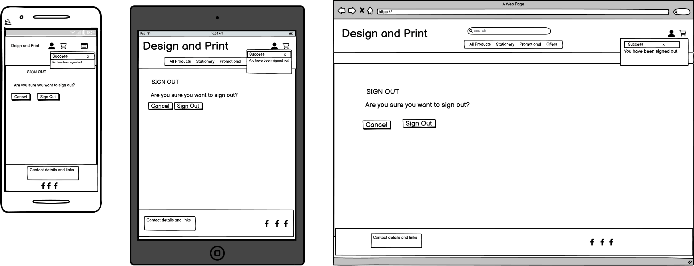

* Profile Page - The profile page enables a user to view their default delivery information. It also displays their order history. The user can click on the order for a detailed view of the order. 

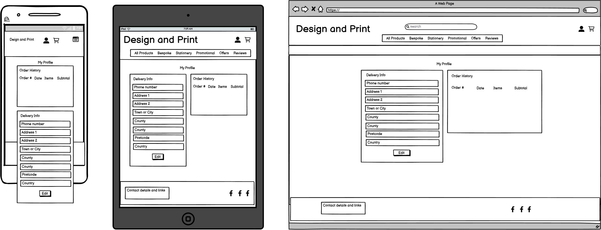

* Products - The products page shows all images in the category. It includes an item image and the product details: title, price, category and rating. The page is responsive on different device sizes.

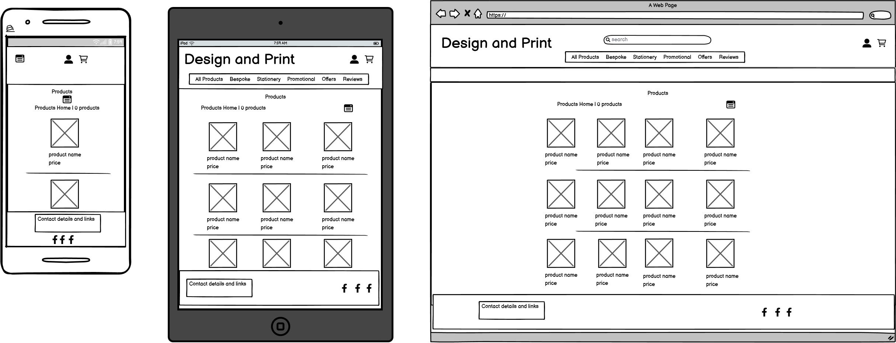

* Product Information - This takes the user to a detailed view of a product. The page includes an image of the product and the product details: title, price, category, and rating. It also includes a quantity selector for the user to choose how many of the product they would like to purchase, and 'Add to bag' button and 'back' to products buttons. This ensures that the user does not need to use the browser ‘back’ button.
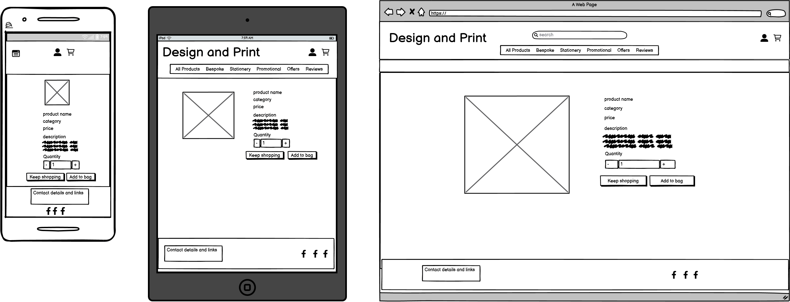

* Product Detail (Admin View) - This page is the same as the product detail page, but is only displayed to logged in Admin users. It features edit and delete buttons to allow the admin to edit and delete a product from the database.

  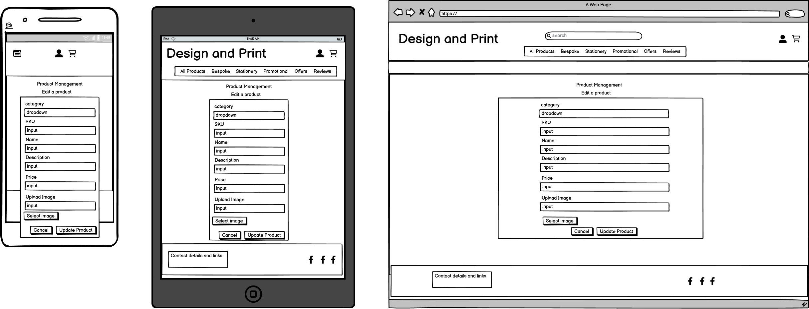

* Bag Page – This page displays an image of the item, and the product details. The user is then able to select the ‘checkout’ button to complete their purchase or to ‘keeping shopping’ if they would prefer to make further additions. This ensures they do not need to use the browser’s back button to navigate the site. 

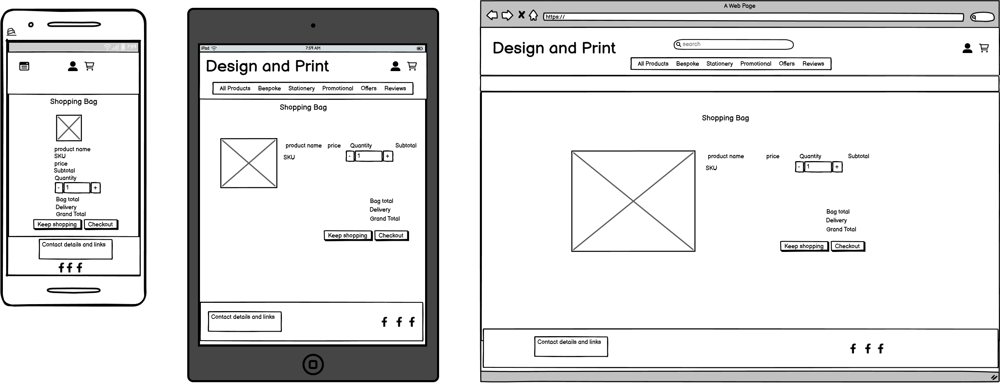

* Checkout Page – This displays the items the user has added to their bag. When the user clicks on the checkout button, they are presented with a form to fill in their details, along with their delivery address. They are given the option to save the information they enter to their profile via a checkbox. The form is pre-populated with this information if they are signed in.
Below this is the payment input section. The user will be required to enter their card information. If there are errors with the information they enter, an error message will be displayed under the input. Once the user clicks on the 'complete order' button, an overlay showing the purchase is in progress is displayed, then a small toast message confirms the purchase has been successful. The user is also redirected to a page that confirms their order number.

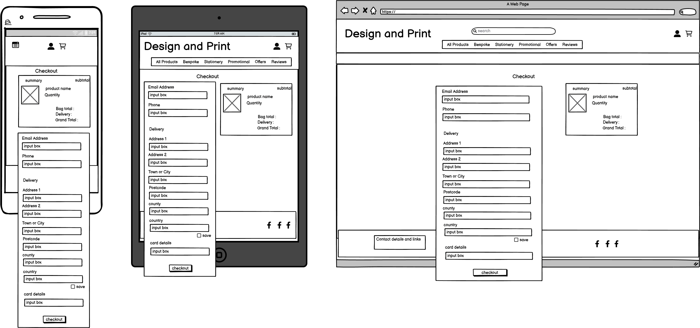

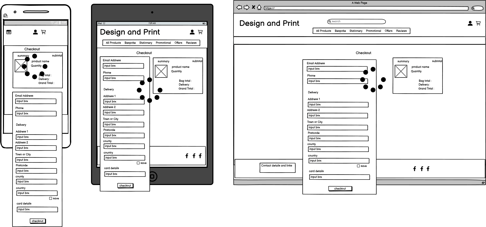

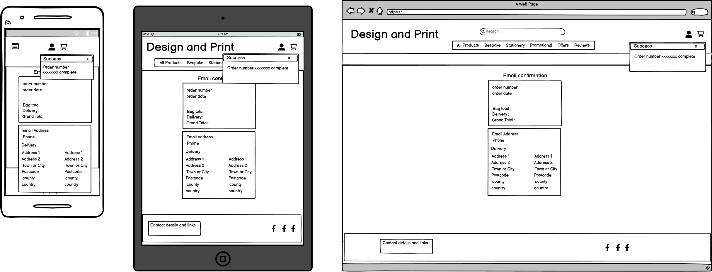

* Bespoke Orders Page – This enables users to request a custom order. The form enables them to select a product category, enter a title, description and colour. They are also able to upload an image to be included on the custom order. Once they have submitted this, the admin is able to provide a quoted price for the order.

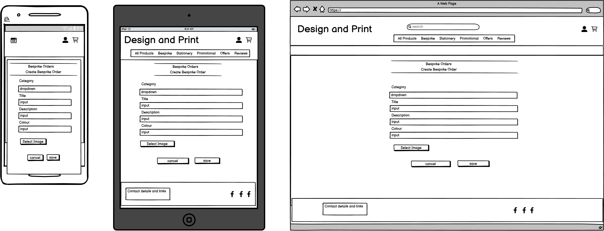

* Bespoke Orders Admin Page – Due to the nature of a custom order being unique, the Admin user is able to provide a quote for the price of the purchase.

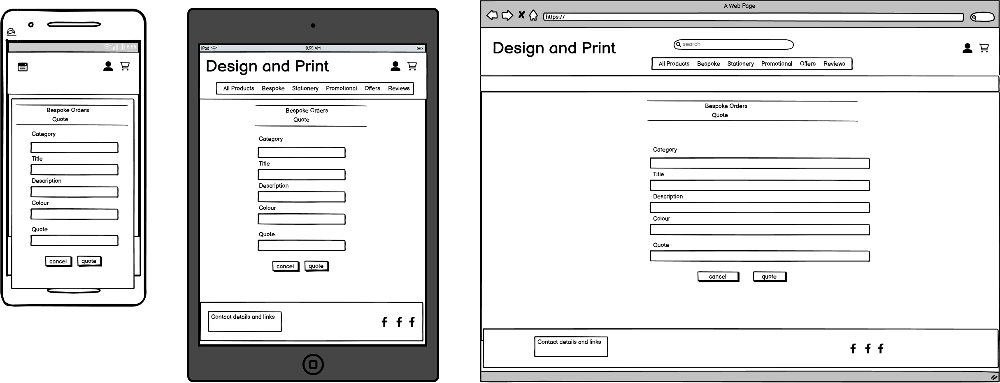

* All Bespoke Orders Admin Page – The Admin user is able to view all requests for Bespoke orders.

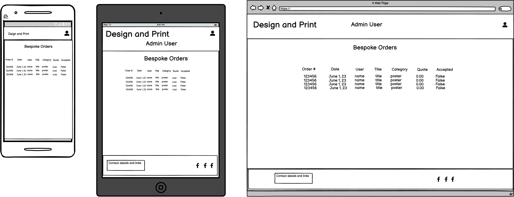

* Bespoke Orders Accept Page – Once the Admin user has provided a quote, the user can accept or decline the quote before the order is processed. 

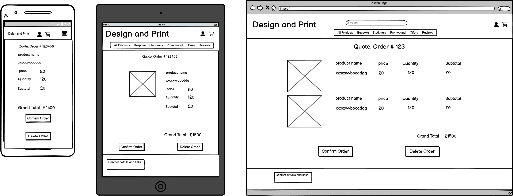

* Reviews Page – Users can post a review of the service they have received. This page displays all customer reviews. 

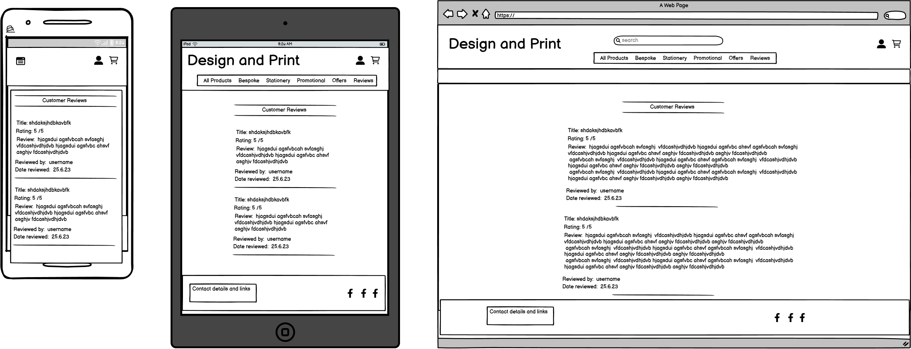

* Reviews Page (Admin View) – Admin users can delete a review if they feel it is inappropriate, duplicated, offensive, etc.  

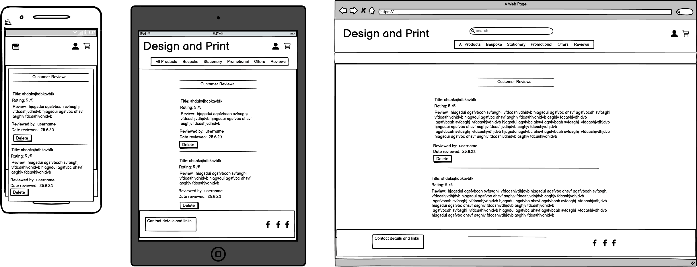

* Add a Review Page – Users can post a review of the service they have received using the form on this page. This form features a title input, a description text area and a rating which is set to a maximum of 5 and a minimum of 1.  

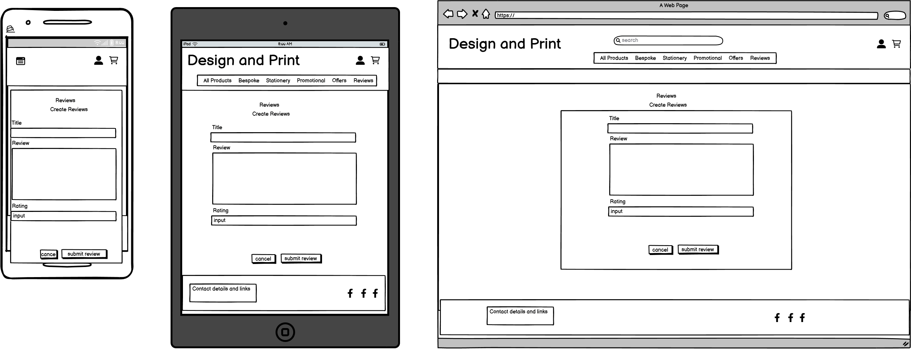

[Back to top](#table-of-contents)

### Features

#### Nav Bar

#### Footer
___

### Pages

The website consists of X pages that run from a base page:

* pages list

#### Page

#### Page

#### Page

#### 404 Error Page
___

### Future Features
Ideas for future implementation include:

 - 

[Back to top](#table-of-contents)
___

## 3. Technologies

### Languages

*

### Frameworks & Libraries

* 

### Storage & Hosting

* 

[Back to top](#table-of-contents)
___

## 4. Testing

A separate [TEST.md](TEST.md) file has been created for the documentation of testing.

[Back to top](#table-of-contents)
___

## 5. Deployment
### Heroku

To deploy 

### Cloning the Git Hub Repository

[Back to top](#table-of-contents)
___

## 6. Credits
### Content

* 

### Media

### Acknowledgements

* Thank yous

[Back to top](#table-of-contents)
___